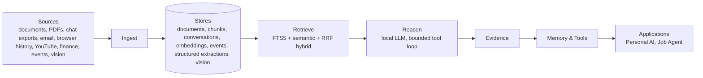
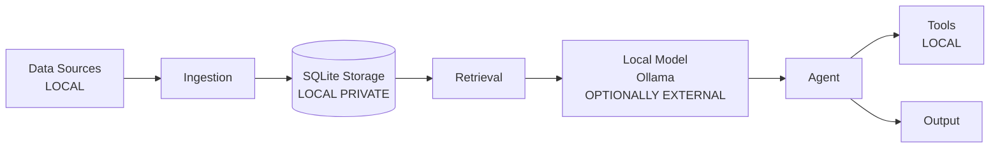
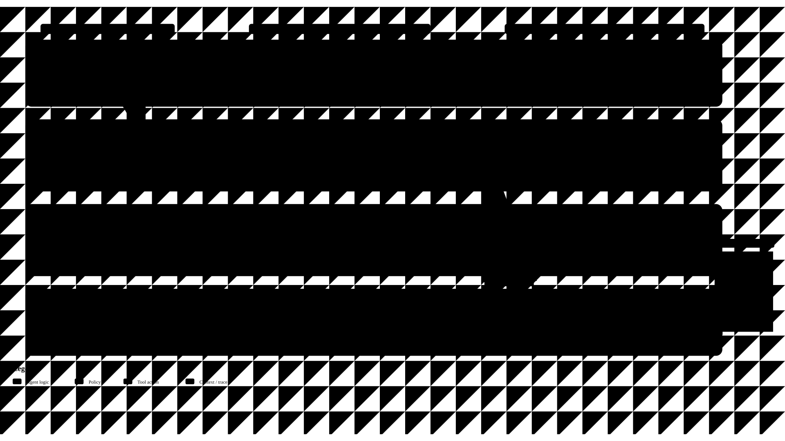

# Personal AI

Local-first personal knowledge and agent platform: evidence-grounded retrieval, governed memory, tool use.

[](https://github.com/Telschow/personal-ai/actions/workflows/ci.yml)

Personal AI ingests personal documents, conversations, email, browser history, YouTube, finance, events and vision data into a local SQLite knowledge base. Retrieval combines full-text and semantic search with hybrid RRF ranking. Reasoning runs on a local LLM with a bounded tool loop that returns evidence citations. Memory is scoped, confidence-weighted and reconciled over time.

Memory lifecycle, provenance tracking and policy-gated tools keep personal data local. The system works offline; external models are optional.



## Design decisions worth reading

* Evidence/provenance-first answers — every answer links to source documents with content hashes. See `src/personal_ai/retrieval.py`, `docs/architecture/MEMORY_ARCHITECTURE.md`.
* Hybrid retrieval with deterministic tie-breaking — FTS5 + semantic vectors combined via Reciprocal Rank Fusion with stable ordering. See `src/personal_ai/retrieval_factory.py`, `docs/retrieval.md`.
* Memory lifecycle — confidence, importance, provenance, temporal scope; candidate → active → archive with reconciliation. See `src/personal_ai/memory/reconcile.py`, `docs/architecture/MEMORY_ARCHITECTURE.md`.
* Bounded agent loop — max rounds, result-size limits, sanitized logging, tool registry. See `src/personal_ai/agent.py`, `docs/architecture/AGENT_ARCHITECTURE.md`.
* Retrieval evaluation harness — recall@k, precision@k, hit@k, MRR; backend failures are surfaced, never turned into zero-result scores. See `src/personal_ai/retrieval_evaluation.py`.
* Privacy policy — local-first, synthetic fixtures, enforced against real contact identifiers in tracked docs/config. See `PUBLIC_DATA_POLICY.md`, `docs/privacy.md`.

## Repository map

| Path | Purpose |
|------|---------|
| `src/` | Runtime code — personal-ai Python package |
| `tests/` | Test suite — synthetic fixtures only |
| `job_agent/` | Companion job search agent — runtime code |
| `docs/` | Architecture, ADRs, user guides |
| `.opencode/` | OpenCode dev-workflow skills, agents, and commands (contributor tooling) |
| `data/`, `previous_project_and_raw_data/` | Local data directories, gitignored |
| `pyproject.toml`, `uv.lock` | Toolchain and dependencies |

## Quick start

```bash
git clone https://github.com/Telschow/personal-ai
cd personal-ai
uv sync --locked --dev
# job_agent is a separate distribution, not a workspace member: the root suite
# needs pytest>=9 while job_agent pins pytest<9. Without this line the 19
# Job-Agent HTTP tests skip silently and you are not running what CI runs.
uv pip install -e ./job_agent
uv run pytest
uv run ruff check src tests scripts
uv run ruff format --check src tests scripts
uv run python scripts/mypy_ratchet.py
```

CLI help:

```bash
uv run python -m personal_ai.cli --help
```

Tests pass on synthetic fixtures under `tests/fixtures/synthetic/`. See `CONTRIBUTING.md` for full setup.

## Status and known limits

* End-to-end answer quality and citation evaluation is in progress; retrieval evaluation harness exists but end-to-end metrics are not fully automated.
* Local LLM quality depends on model choice and hardware.
* Vector search is optional and requires an embedding model.
* Ingestion is explicit; no automatic monitoring of personal directories.
* Memory does not automatically expire; manual curation required.

## Details

## What is Personal AI?

Personal AI is a single-user platform for managing personal knowledge locally. It provides deterministic ingestion, retrieval and memory layers with an optional local LLM agent for synthesis. Data remains on your hardware; the system is designed to work without external services.

## Why local-first?

* Privacy by default: personal content stays on your machine
* Reproducibility: deterministic pipelines with content-hash idempotency
* Control: explicit ingestion, explicit memory writes, policy-gated tools
* Offline capable: core retrieval and memory work without LLM

## Architecture



LOCAL = runs on your machine. OPTIONALLY EXTERNAL = only if you configure it.

## See it in action



A deterministic, offline demo runs this repository's own ingestion, retrieval,
provenance, and policy code against a fixed synthetic corpus, then stops at the
human approval boundary.

### The eight stages

| # | Stage | What actually happens |
|---|-------|----------------------|
| 1 | Private input | Two fixed synthetic documents enter the process. Nothing is read from disk and no external service is contacted. |
| 2 | Ingest | `DocumentIngestor` canonicalises, classifies both documents as `text_heavy`, and produces 2 deterministic chunks. |
| 3 | Retrieve | The keyword backend (`SQLiteChunkIndex`, FTS5 native BM25) returns 2 ranked hits. No embedding model is involved. |
| 4 | Evidence | Each hit resolves to a chunk id, document id, source key, and content hash. Provenance is complete for every hit. |
| 5 | Local reasoning | A structured summary is assembled deterministically from the retrieval outcome. No language model is called, so there is no chain-of-thought to show. |
| 6 | Policy | `PolicyEngine` evaluates the proposed outbound action and returns `approval_required` for `Permission.network`. |
| 7 | Human approval | `PolicyEngine.execute` raises `ApprovalRequiredError`; the handler never runs. The plan state machine also refuses `needs_approval` to `completed`. |
| 8 | Bounded action | Zero actions are performed. The run ends here on purpose. |

Stage output is written to `artifacts/demo/results.json` (what happened) and
`artifacts/demo/metadata.json` (provenance of the run itself).

### Explore it interactively

[`docs/architecture/demo.html`](docs/architecture/demo.html) is a single
self-contained file: no external fonts, scripts, or CDN requests, so it opens
straight from disk or from a clone.

### Regenerate everything

```bash
uv run python -m personal_ai.demo                  # results.json + metadata.json
uv run python scripts/render_demo_snapshot.py      # snapshot.png
```

To rebuild the interactive diagram from its checked-in specification
(`docs/architecture/demo.workflow.json`) you need the `archify` skill:

```bash
node .opencode/skills/archify/bin/archify.mjs deliver workflow \
  artifacts/demo/demo.workflow.json artifacts/demo/demo.html --quality showcase
uv run python scripts/render_demo_snapshot.py --html artifacts/demo/demo.html \
  --out docs/architecture/demo-snapshot.png
```

### What this demo is not

* **It is not a benchmark.** It shows architecture. No accuracy, latency,
  recall, or throughput number is measured, claimed, or implied. The BM25 ranks
  in `results.json` are raw ranking values from this run, not a quality score.
* **It says nothing about model quality.** No language model is called. The
  reasoning stage is a deterministic summary of retrieved evidence.
* **It is not autonomous.** The system performs no action without explicit
  human approval. Steps 7 and 8 exist to prove that, and
  `tests/test_demo.py` fails if the boundary ever stops holding.
* **It contains no real data.** No personal documents, CV, email, finances, or
  job-search history. Addresses use the reserved `example.invalid` domain.
* **It is not a production-readiness claim.** It is a narrow, synthetic
  illustration of one path through the code.

### Determinism and privacy

* **Synthetic only.** Every corpus string carries a `SYNTHETIC-DEMO-DATA`
  marker, asserted by the test suite.
* **Offline.** No network call, no LLM, and no local model. Tests run the demo
  with `socket` and the Ollama client disabled, and fail if the demo package
  ever gains a network or model-client import.
* **Deterministic.** Fixed corpus and fixed timestamps, no wall-clock reads,
  BM25 ties broken on chunk id. Both JSON artifacts are byte-identical across
  runs and across machines.
* **No hidden reasoning.** Only user-facing structured metadata and the chunk
  identifiers it cited are recorded.

Generated run output under `artifacts/` is gitignored; the diagram, its
specification, and the snapshot are checked in so this README renders. The
properties above are asserted in `tests/test_demo.py`.

## Features

* Document ingestion with deterministic chunking and optional embeddings
* Keyword and semantic retrieval with hybrid RRF
* Structured memory with scope, confidence, provenance
* People identity canonicalization
* Policy-gated agent with tool registry
* OpenAI-compatible HTTP API
* CLI for ingestion, search, memory management
* Workout and event ingestion
* Job agent integration via read-only SQLite bridge

## Privacy model

Personal data is intended to remain local. Private runtime data is not included in Git. Examples use synthetic data. Credentials belong in local configuration only. Users should inspect data sources before ingestion. External model providers may receive data only when explicitly configured. Local models can be used where supported.

The public repository excludes private source data, credentials, and runtime
personal data. Tests and examples use synthetic data; `tests/test_privacy_regression.py`
enforces this in CI. Personal runtime data (ingested documents, databases,
career configuration) stays local and gitignored. See `docs/privacy.md`.

## Installation

Requires Python 3.14+ and uv.

```bash
git clone https://github.com/Telschow/personal-ai
cd personal-ai
uv sync
```

## Configuration

Copy `.env.example` to `.env` and fill local values.

```bash
cp .env.example .env
```

Configure `OLLAMA_BASE_URL`, data directories, and optional models. Never commit `.env`.

### Job Agent local configuration

The Job Agent is configured from local YAML files that are gitignored because
they describe a personal job search. The repository ships synthetic examples
instead:

```bash
cp job_agent/config.example.yaml job_agent/config.yaml
cp job_agent/company_radar.example.yaml job_agent/company_radar.yaml
```

Both are optional. `job_agent/config.py` falls back to built-in defaults when
`config.yaml` is absent, and `job_agent/company_radar.py` treats a missing
`company_radar.yaml` as an empty radar, so a fresh checkout never fetches
anything. Values in the examples use synthetic placeholders that discovery
skips.

### Local configuration

OpenCode config may contain credentials. Do not commit it.

```bash
cp opencode.example.json opencode.json
export FREELLMAPI_API_KEY=...
```

`opencode.json` is gitignored. The example uses `{env:FREELLMAPI_API_KEY}` substitution.

## Running locally

```bash
uv run personal-ai server --host 127.0.0.1 --port 8000
```

CLI example with synthetic data:

```bash
uv run personal-ai ingest --source filesystem tests/fixtures/synthetic/
uv run personal-ai search --query "project alpha"
```

## Testing

```bash
uv run pytest
uv run ruff check .
uv run ruff format --check .
```

Tests use synthetic fixtures only under `tests/fixtures/synthetic/`.

## Development

See `CONTRIBUTING.md` for setup, tests, lint, format, type checking, adding connectors/tools/models.

## Roadmap

See `docs/roadmap.md`.

## Limitations

* Local LLM quality depends on model choice and hardware
* Vector search is optional and requires embedding model
* Ingestion is explicit; no automatic monitoring of personal directories
* Memory does not automatically expire; manual curation required

## Security

See `SECURITY.md` for reporting.

## Contributing

Contributions welcome. Follow privacy requirements: no real personal data in commits, synthetic fixtures only.

## License

See `LICENSE`.
