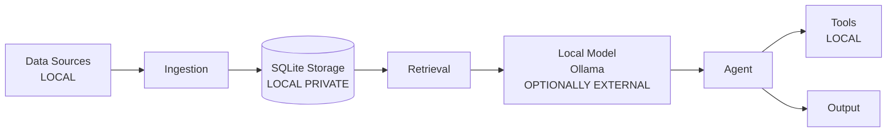

# Personal AI

Local-first personal knowledge and agent system. Ingests your own files, conversations, exports and activity into a SQLite knowledge base on your machine, and answers questions through a local model run by Ollama. No cloud APIs required for core operation.

## What is Personal AI?

Personal AI is a single-user platform for managing personal knowledge locally. It provides deterministic ingestion, retrieval and memory layers with an optional local LLM agent for synthesis. Data remains on your hardware; the system is designed to work without external services.

## Why local-first?

* Privacy by default: personal content stays on your machine
* Reproducibility: deterministic pipelines with content-hash idempotency
* Control: explicit ingestion, explicit memory writes, policy-gated tools
* Offline capable: core retrieval and memory work without LLM

## Architecture



LOCAL = runs on your machine. OPTIONALLY EXTERNAL = only if you configure it.

## Features

* Document ingestion with deterministic chunking and optional embeddings
* Keyword and semantic retrieval with hybrid RRF
* Structured memory with scope, confidence, provenance
* People identity canonicalization
* Policy-gated agent with tool registry
* OpenAI-compatible HTTP API
* CLI for ingestion, search, memory management
* Workout and event ingestion
* Job agent integration via read-only SQLite bridge

## Privacy model

Personal data is intended to remain local. Private runtime data is not included in Git. Examples use synthetic data. Credentials belong in local configuration only. Users should inspect data sources before ingestion. External model providers may receive data only when explicitly configured. Local models can be used where supported.

The repository contains no real personal data. See `docs/privacy.md`.

## Installation

Requires Python 3.14+ and uv.

```bash
git clone https://github.com/Telschow/personal-ai
cd personal-ai
uv sync
```

## Configuration

Copy `.env.example` to `.env` and fill local values.

```bash
cp .env.example .env
```

Configure `OLLAMA_BASE_URL`, data directories, and optional models. Never commit `.env`.

## Running locally

```bash
uv run personal-ai server --host 127.0.0.1 --port 8000
```

CLI example with synthetic data:

```bash
uv run personal-ai ingest --source filesystem tests/fixtures/synthetic/
uv run personal-ai search --query "project alpha"
```

## Testing

```bash
uv run pytest
uv run ruff check .
uv run ruff format --check .
```

Tests use synthetic fixtures only under `tests/fixtures/synthetic/`.

## Development

See `CONTRIBUTING.md` for setup, tests, lint, format, type checking, adding connectors/tools/models.

## Roadmap

See `docs/roadmap.md`.

## Limitations

* Local LLM quality depends on model choice and hardware
* Vector search is optional and requires embedding model
* Ingestion is explicit; no automatic monitoring of personal directories
* Memory does not automatically expire; manual curation required

## Security

See `SECURITY.md` for reporting.

## Contributing

Contributions welcome. Follow privacy requirements: no real personal data in commits, synthetic fixtures only.

## License

See `LICENSE`.

